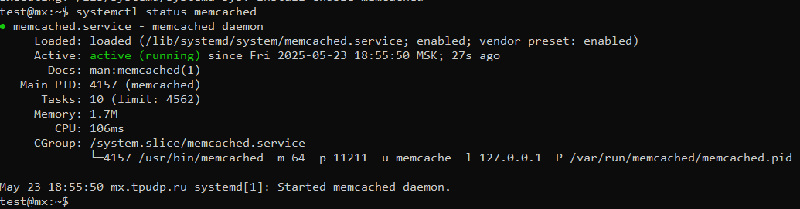
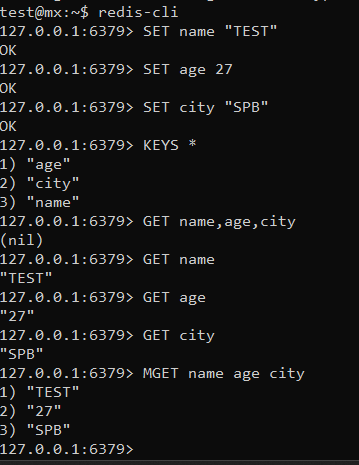

# Кэширование Redis/memcached

# Домашнее задание к занятию «Кэширование Redis/memcached»
## Андреев Александр Вадимович

### Задание 1. Кеширование
####Приведите примеры проблем, которые может решить кэширование.
####Приведите ответ в свободной форме.

- Снижение нагрузки на базу данных:
  При частых запросах к БД, кэширование позволяет снизить количество обращений за счет хранения результатов в памяти (например, часто запрашиваемые данные о пользователях или товарах).

- Ускорение отклика приложения:
  Получение данных из кэша происходит быстрее, чем выполнение сложного SQL-запроса или обработка API-запроса.

- Оптимизация работы с внешними API:
  Если ваше приложение обращается к стороннему API, кэширование позволяет сохранять ответы и использовать их повторно, не делая лишних HTTP-запросов.

- Обработка трафика при всплеске нагрузки:
  В моменты высокой посещаемости кэш помогает справиться с нагрузкой, отдавая статичные данные без перегрузки backend-сервисов.

- Реализация Rate Limiting:
  Кэширование позволяет эффективно ограничивать число запросов от пользователей (например, через хранение счетчика запросов по IP).

### Задание 2. Memcached
#### Установите и запустите memcached.
#### Приведите скриншот systemctl status memcached, на котором будет видно, что memcached запущен.

### Задание 3. Удаление по TTL в Memcached
#### Запишите в memcached несколько ключей с любыми именами и значениями, для которых установлен TTL 5.
#### Приведите скриншот, на котором видно, что через 5 секунд ключи были удалены из базы.

		 
### Задание 4. Запись данных в Redis
#### Запишите в Redis несколько ключей с любыми именами и значениями.
#### С помощью redis-cli извлеките все записанные ключи и значения из базы и сделайте скриншот этой операции.

